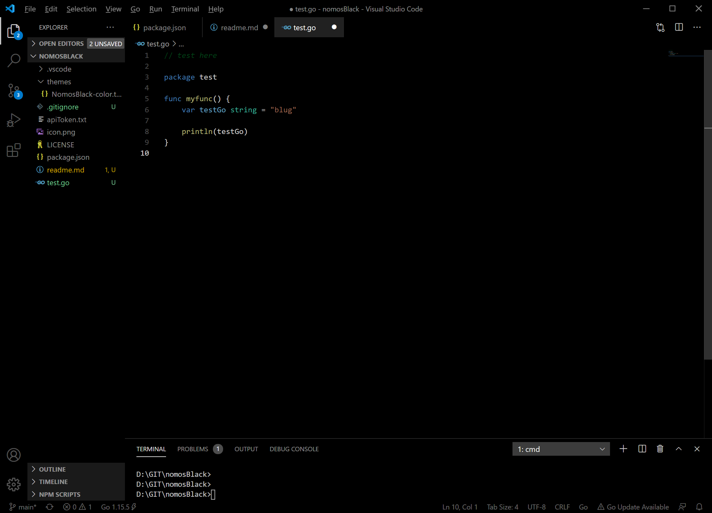

nomosBlack theme
===========

Based on the default Dark+ theme, with a pure black background and lower contrast colors. I needed to create this for reduced eye strain when used with OLED screens that are both bright and have a true black capability.

To use it click the "set color theme" button on the expansion page or use the menu: File -> Preferences -> Color Theme (shortcut: Ctrl+K Ctrl+T) after installation.

